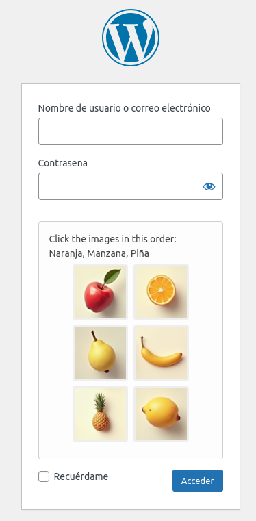
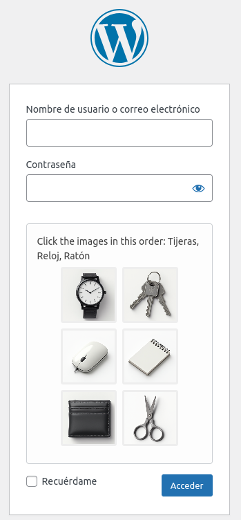
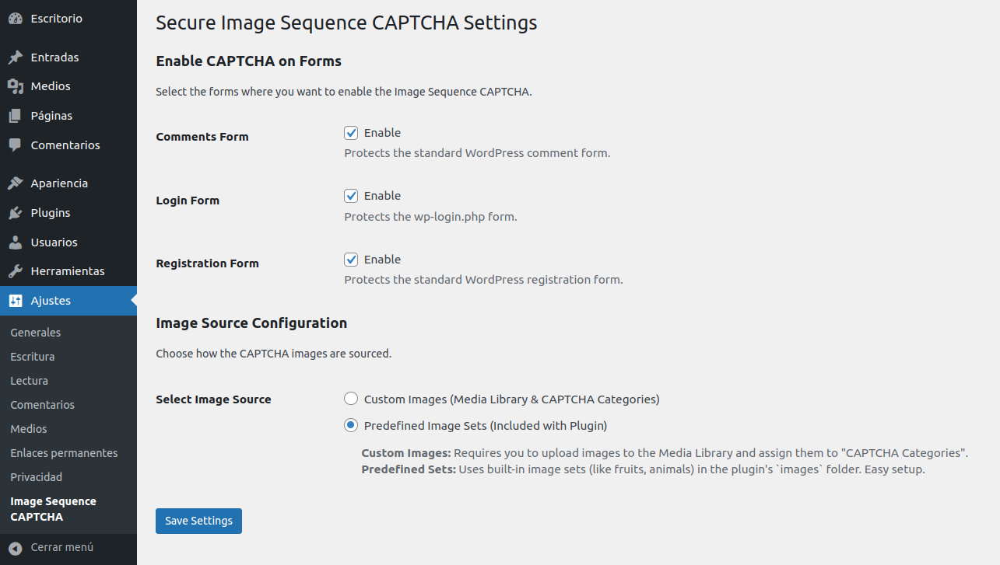
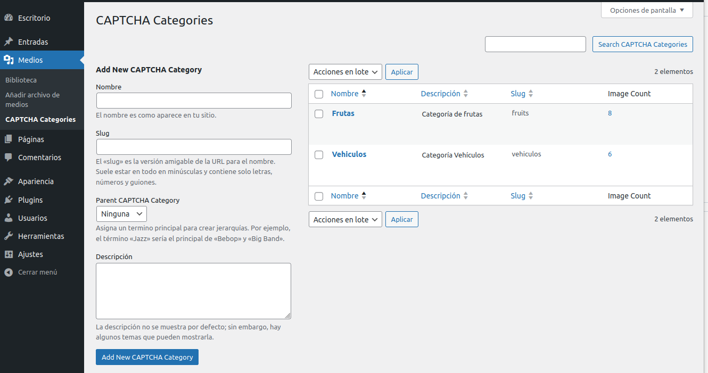

# Secure Image Sequence CAPTCHA

Protege tus formularios de comentarios, inicio de sesión y registro de WordPress contra bots con un CAPTCHA de secuencia de imágenes seguro y fácil de usar.

---

## Descripción

Secure Image Sequence CAPTCHA mejora la seguridad de tu sitio web añadiendo un desafío CAPTCHA intuitivo a tus formularios. En lugar de descifrar texto difícil de leer, los usuarios simplemente hacen clic en una serie de imágenes en el orden correcto según las instrucciones. Este plugin se centra en una seguridad robusta y la facilidad de uso.

**Características Clave de Seguridad:**

*   🔐 **IDs Temporales:** Cada imagen mostrada utiliza un ID temporal único y criptográficamente seguro para ese desafío específico.
*   🛡️ **Nonces:** Cada envío de CAPTCHA está protegido por un nonce de WordPress vinculado a la instancia específica del desafío, previniendo ataques CSRF y de repetición.
*   ⏱️ **Transitorios:** Los datos del desafío (como la secuencia correcta) se almacenan de forma segura en transitorios de WordPress de corta duración y se eliminan inmediatamente después de la validación.
*   ✔️ **Validación Segura:** La validación ocurre en el lado del servidor, comparando la secuencia de IDs temporales enviada con la secuencia correcta almacenada.
*   🚫 **Sin Texto Plano:** Las respuestas correctas nunca se exponen en el código fuente HTML del frontend.

**Funcionalidades Clave:**

*   📝 **Protección Múltiple de Formularios:** Habilita el CAPTCHA en Comentarios, Formulario de Inicio de Sesión (`wp-login.php`) y Formulario de Registro.
*   🖼️ **Fuentes de Imágenes Flexibles:**
    *   **Imágenes Personalizadas:** Sube tus propias imágenes a la Biblioteca de Medios y organízalas usando la taxonomía dedicada "Medios -> Categorías CAPTCHA".
    *   **Conjuntos Predefinidos:** Utiliza conjuntos de imágenes incorporados (como frutas, animales) incluidos directamente en la carpeta `/images` del plugin para una configuración rápida.
*   ⚙️ **Página de Ajustes de Admin:** Configura fácilmente dónde aparece el CAPTCHA y selecciona la fuente de imágenes en "Ajustes -> Image Sequence CAPTCHA".
*   📊 **Contador de Admin Corregido:** Corrige el error visual donde la columna "Cantidad" para la taxonomía Categorías CAPTCHA mostraba incorrectamente '0' para los adjuntos, mostrando el recuento correcto en su lugar.
*   🌍 **Listo para Internacionalización:** Las cadenas de texto del plugin son traducibles (requiere generación de archivo `.pot` y archivos `.po`/`.mo`).

Este plugin proporciona una alternativa sólida a los CAPTCHAs tradicionales basados en texto, ofreciendo un equilibrio entre seguridad y experiencia de usuario.

---

## Instalación

1.  **Descarga:** Descarga el archivo `.zip` de la última versión desde la [página de Releases](https://github.com/Soyunomas/Secure-Image-Sequence-CAPTCHA/releases).
2.  **Admin de WordPress:**
    *   En tu panel de administración de WordPress, ve a `Plugins` > `Añadir nuevo`.
    *   Haz clic en `Subir plugin`.
    *   Selecciona el archivo ZIP descargado (`secure-image-sequence-captcha.zip`) y haz clic en `Instalar ahora`.
    *   Activa el plugin a través del menú `Plugins`.
3.  **FTP:**
    *   Descomprime el archivo descargado.
    *   Sube la carpeta completa `secure-image-sequence-captcha` al directorio `/wp-content/plugins/` en tu servidor.
    *   Activa el plugin a través del menú `Plugins` en WordPress.

---

## Configuración y Uso

1.  Ve a `Ajustes` > `Image Sequence CAPTCHA` en tu panel de administración de WordPress.
2.  **Habilitar CAPTCHA en Formularios:** Marca las casillas para `Formulario de comentarios`, `Formulario de inicio de sesión` y/o `Formulario de registro` donde quieras que aparezca el CAPTCHA.
3.  **Seleccionar Fuente de Imágenes:**
    *   **Imágenes Personalizadas (Biblioteca de Medios y Categorías CAPTCHA):**
        *   Elige esta opción si quieres usar tus propias imágenes subidas.
        *   **Debes** crear categorías en `Medios` > `Categorías CAPTCHA`.
        *   **Debes** subir imágenes a la `Biblioteca de Medios` y asignarlas a tus Categorías CAPTCHA creadas.
        *   Cada categoría necesita **al menos 6 imágenes** asignadas. Los títulos de las imágenes se usarán para la pregunta de la secuencia.
    *   **Conjuntos de Imágenes Predefinidos (Incluidos con el Plugin):**
        *   Elige esta opción para un inicio rápido usando conjuntos de imágenes incluidos con el plugin.
        *   Esto requiere que tú (el desarrollador/mantenedor del plugin) coloques conjuntos de imágenes dentro de la carpeta `images/` del plugin.
        *   Estructura: `secure-image-sequence-captcha/images/nombre_set/imagen.jpg` (ej., `images/fruits/apple.png`, `images/animals/cat.jpg`).
        *   Cada subcarpeta `nombre_set` necesita **al menos 6 imágenes** (`.jpg`, `.jpeg`, `.png`, `.gif`, `.webp`).
        *   El nombre del archivo de imagen (sin extensión, con espacios en lugar de guiones/barras bajas) se usará para la pregunta de la secuencia.
4.  Haz clic en `Guardar cambios`.

**Nota Importante sobre el Tamaño de las Imágenes:** Para asegurar una experiencia de usuario consistente y evitar problemas de diseño, las imágenes del CAPTCHA se mostrarán con un tamaño **máximo de 100x100 píxeles** en el frontend. Aunque puedes subir imágenes más grandes (especialmente para la opción "Personalizada"), serán redimensionadas visualmente por el CSS del plugin. Para la opción "Predefinida", se recomienda usar imágenes cercanas a este tamaño (ej., 75x75px) para una carga más rápida.

El CAPTCHA aparecerá ahora en los formularios seleccionados usando la fuente de imágenes elegida.

---

## Preguntas Frecuentes (FAQ)

### ¿Cómo uso mis propias imágenes (Imágenes Personalizadas)?

1.  Ve a `Medios` > `Biblioteca` y sube tus imágenes. Usa títulos descriptivos (ej., "Manzana", "Plátano", "Coche").
2.  Ve a `Medios` > `Categorías CAPTCHA` y crea una o más categorías (ej., "Frutas", "Vehículos").
3.  Vuelve a `Medios` > `Biblioteca`, cambia a vista de Lista si es necesario, y asigna tus imágenes subidas a la Categoría CAPTCHA apropiada.
4.  Asegúrate de que cada categoría que quieras usar tenga **al menos 6 imágenes** asignadas.
5.  Ve a `Ajustes` > `Image Sequence CAPTCHA` y selecciona `Imágenes Personalizadas` como `Fuente de Imágenes`.

### ¿Cómo uso los Conjuntos de Imágenes Predefinidos?

1.  Esto requiere que el paquete del plugin contenga las imágenes. Crea una carpeta `images` en la raíz del plugin (`wp-content/plugins/secure-image-sequence-captcha/images/`).
2.  Dentro de `images`, crea subcarpetas para cada conjunto (ej., `images/fruits/`, `images/animals/`).
3.  Coloca los archivos de imagen (`.jpg`, `.png`, `.gif`, `.webp`) dentro de estas subcarpetas. Se recomienda usar imágenes de aproximadamente 75x75 píxeles.
4.  Asegúrate de que cada subcarpeta tenga **al menos 6 imágenes**.
5.  Ve a `Ajustes` > `Image Sequence CAPTCHA` y selecciona `Conjuntos de Imágenes Predefinidos` como `Fuente de Imágenes`.

### ¿Cuántas imágenes necesito por categoría o conjunto?

Se requiere un mínimo de **6 imágenes** por categoría personalizada o carpeta de conjunto predefinido. Esto permite al plugin seleccionar 3 imágenes para la secuencia correcta y 3 imágenes distractoras.

---

## Capturas de Pantalla

<table>
  <tr>
    <td align="center">
      <b>Formulario de Inicio de Sesión</b> 
      
    </td>
    <td align="center">
      <b>Formulario de Inicio de Sesión</b> 
      
    </td>
  </tr>
  <tr>
    <td align="center">
      <b>Settings</b> 
      
    </td>
    <td align="center">
      <b>Formulario de creación de categorías</b> 
      
    </td>
  </tr>
</table>

---

## Contribuciones

¡Las contribuciones son bienvenidas! Si encuentras un error o tienes una solicitud de función, por favor abre un [issue](https://github.com/Soyunomas/Secure-Image-Sequence-CAPTCHA/issues). Si quieres contribuir con código, por favor abre un [pull request](https://github.com/Soyunomas/Secure-Image-Sequence-CAPTCHA/pulls).

---

## Changelog (Historial de Cambios)

### **1.4.1 (Actual y Recomendada)**
*   **Corrección de Seguridad (Severidad Alta):** Se ha corregido una vulnerabilidad de **Enumeración de Usuarios** (`User Enumeration`, CWE-203) en el formulario de inicio de sesión. Anteriormente, era posible determinar si un nombre de usuario existía o no analizando las respuestas de error, incluso sin resolver el CAPTCHA. La validación del CAPTCHA ahora se ejecuta antes que la autenticación de credenciales, bloqueando completamente esta fuga de información. Agradecemos el análisis que ha llevado a esta corrección.
*   **Mejora de Seguridad (Hardening):** El mecanismo "Fail-Safe" ha sido mejorado. Ahora, si el CAPTCHA no puede generarse usando "Imágenes Personalizadas" (por ejemplo, debido a falta de imágenes), el plugin **hará un fallback automático y seguro para usar los "Conjuntos de Imágenes Predefinidos"** si están disponibles. Esto mantiene la protección del formulario activa en todo momento, previniendo una posible Denegación de Servicio (DoS) lógica por agotamiento de recursos y eliminando el comportamiento de "fail-open" de la v1.4.0.

### 1.4.0
*   **Corrección de Estabilidad:** Solucionado un fallo que podía bloquear a los administradores fuera de su propio sitio si una categoría de imágenes personalizada no tenía el número mínimo de imágenes requerido.
*   **Implementado Mecanismo "Fail-Safe" (Ahora Mejorado en 1.4.1):** Si el CAPTCHA no se puede generar por un error de configuración, el plugin ahora permitirá que los formularios (inicio de sesión, registro) se envíen, previniendo el bloqueo del sitio y priorizando el acceso del administrador. *Nota: Este comportamiento ha sido reemplazado por un fallback más seguro en la v1.4.1.*
*   **Mejora de UX (Avisos Inteligentes):** El plugin ahora muestra avisos contextuales en la página de Ajustes: un error (rojo) si el CAPTCHA está inactivo por falta de imágenes, y una advertencia (amarillo) si algunas categorías están mal configuradas y están siendo ignoradas.
*   **Mejora de UX (Guía Contextual):** Añadido un aviso informativo en la página "Medios -> Categorías CAPTCHA" para recordar al administrador el requisito mínimo de 6 imágenes.
*   **Refactorización de la Lógica de Generación:** La selección de imágenes personalizadas ahora filtra proactivamente las categorías inválidas, asegurando que el CAPTCHA siempre use un conjunto de imágenes válido si existe alguno, mejorando la robustez general.

### 1.3.2
*   Optimización: Estandarizado el tamaño de las imágenes predefinidas incluidas a 75x75px para consistencia y rendimiento.
*   Mejora: Añadida nota en el readme sobre el tamaño máximo de visualización de 100x100px.

### 1.3.1
*   Corrección: Mostrar correctamente el número de imágenes asociadas en la columna "Image Count" en la pantalla de admin de Categorías CAPTCHA.
*   Ajuste: Refinamientos menores de código.

### 1.3.0
*   Característica: Añadido soporte CAPTCHA para el formulario de Inicio de Sesión de WordPress.
*   Característica: Añadido soporte CAPTCHA para el formulario de Registro de WordPress.
*   Corrección: Implementada solución alternativa de redirección/transitorio para posible error fatal en fallo de envío de comentarios.
*   Mejora: Lógica de carga de assets mejorada para frontend y pantallas de login/registro.
*   Mejora: Añadidas clases CSS de contexto (`.sisc-context-*`) al contenedor CAPTCHA.

### 1.2.1
*   Corrección: Ajustado manejo de CSS usando `wp_add_inline_style` para dimensiones de imagen flexibles.
*   Actualización: Cambiada dimensión máxima de imagen por defecto a 75px mediante constante.

### 1.2.0
*   Característica: Añadida opción para usar Conjuntos de Imágenes Predefinidos incluidos con el plugin (estructura `images/setname/`).
*   Característica: Añadido ajuste "Fuente de Imágenes" (Personalizada vs. Predefinida).
*   Mejora: Lógica mejorada para encontrar conjuntos de imágenes predefinidos.
*   Mejora: Añadido soporte para imágenes `.webp` en conjuntos predefinidos.
*   Corrección: Movido CSS inline a archivo separado y encolado correctamente.

### 1.1.0
*   Versión inicial estable candidata con protección para formulario de Comentarios.
*   Implementada generación segura de CAPTCHA (IDs temporales, nonces, transitorios).
*   Añadida página de Ajustes y Taxonomía Personalizada.

---

## Licencia

GPL v2 or later

---
